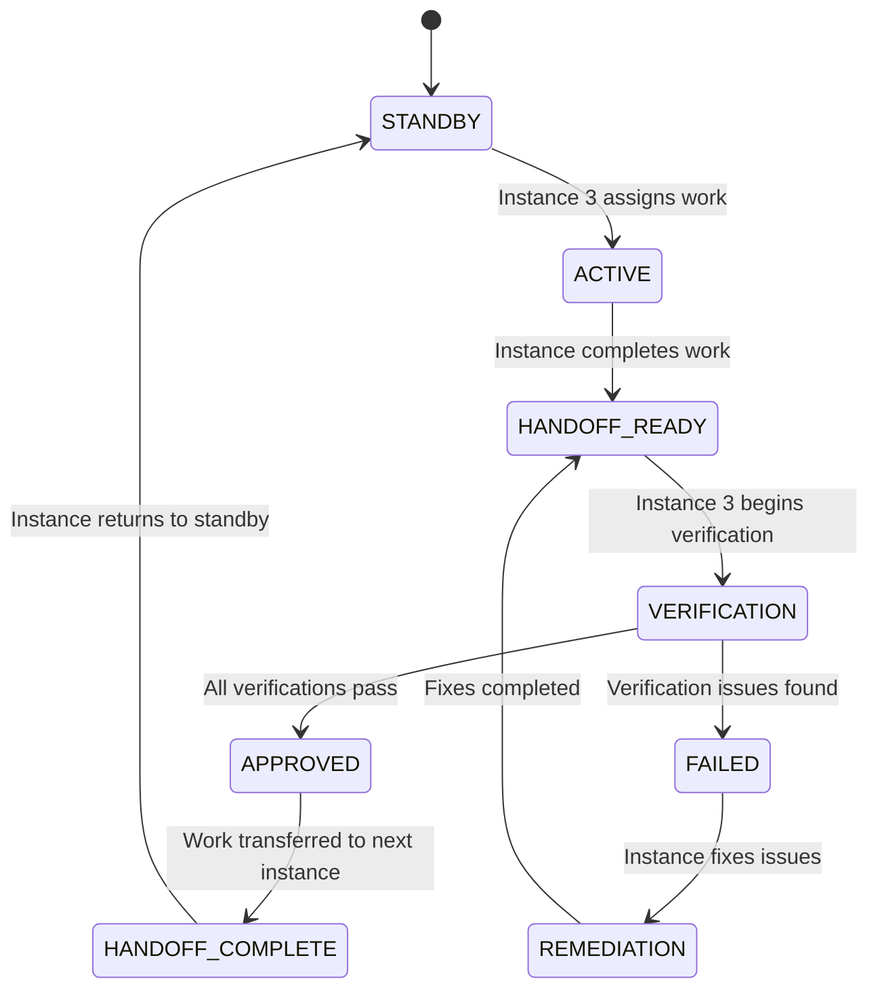

# Asynchronous Handoff Protocols

## Overview

The 3-instance autonomous coordination system enables seamless handoffs between instances without requiring user intervention for each transition. Instance 3 acts as the coordination authority, automatically verifying handoffs and directing subsequent work.

## Core Handoff States

### State Machine for Autonomous Handoffs



## Instance 3: Autonomous Coordination Protocol

### Monitoring Cycle (Every 30 seconds)

```typescript
interface MonitoringCycle {
  checkInstanceStatus(): void;
  processHandoffRequests(): void;
  runVerificationSuite(): Promise<VerificationResult>;
  approveOrDenyHandoffs(): void;
  coordinateNextInstance(): void;
}
```

### Verification Suite Execution

**Phase 1: Pre-Verification Checks**
- Database schema consistency verification
- IPC contract validation
- Cache pipeline integrity test
- File system state verification

**Phase 2: Integration Testing**
- End-to-end data flow verification
- Component integration validation
- Service communication testing
- Performance benchmark verification

**Phase 3: Handoff Decision**
- Auto-approve if all verifications pass
- Auto-deny if critical failures detected
- Escalate to user only for ambiguous cases

## Asynchronous Work Assignment

### Instance 1 (Backend) Assignment Protocol

```typescript
interface BackendWorkAssignment {
  assignmentType: 'database' | 'api' | 'ipc' | 'service';
  priority: 'critical' | 'high' | 'medium' | 'low';
  dependencies: string[];
  estimatedDuration: number;
  verificationRequirements: VerificationStep[];
}
```

**Automatic Assignment Triggers:**
- Database schema changes detected
- API contract modifications needed
- IPC handler gaps identified
- Backend service optimization required

### Instance 2 (Frontend) Assignment Protocol

```typescript
interface FrontendWorkAssignment {
  assignmentType: 'component' | 'hook' | 'ui' | 'integration';
  dependencies: string[];
  backendRequirements: string[];
  testingRequirements: TestStep[];
  uiValidationSteps: UIValidation[];
}
```

**Automatic Assignment Triggers:**
- Component updates needed for new data
- Hook modifications for API changes
- UI adjustments for new features
- Integration work after backend completion

## Handoff Verification Automation

### Critical Verification Steps

1. **Database Layer Verification**
   ```bash
   node scripts/integration/verify-database-schema.js
   ```
   - Schema consistency with TypeScript interfaces
   - Migration completeness
   - Index optimization verification

2. **IPC Contract Verification**
   ```bash
   node scripts/integration/verify-ipc-contracts.js
   ```
   - Frontend calls match backend handlers
   - Response format consistency
   - Error handling completeness

3. **Cache Pipeline Verification**
   ```bash
   node scripts/integration/verify-cache-pipeline.js
   ```
   - End-to-end cache invalidation
   - Data propagation timing
   - Cache consistency across layers

### Auto-Approval Criteria

**APPROVE if:**
- All verification scripts pass with 0 critical/high issues
- Performance benchmarks met or exceeded
- No integration gaps detected
- Test coverage requirements satisfied

**DENY if:**
- Any critical verification failures
- Integration gaps present (missing IPC handlers, etc.)
- Performance regressions detected
- Test coverage below threshold

**ESCALATE if:**
- Mixed results with unclear impact
- New patterns not covered by verification scripts
- Performance impact unclear
- User input needed for design decisions

## Emergency Coordination Protocols

### Instance Failure Detection

```typescript
interface InstanceHealthCheck {
  lastHeartbeat: Date;
  statusFileUpdate: Date;
  gitCommitActivity: Date;
  responseTime: number;
  workQuality: 'good' | 'degraded' | 'failed';
}
```

**Failure Recovery Steps:**
1. Detect stale instances (>45 minutes without status update)
2. Attempt instance reactivation through status file communication
3. If non-responsive, mark work for recovery by Instance 3
4. Reassign critical work to responsive instance
5. Document failure for post-mortem analysis

### Cross-Instance Debugging Coordination

When complex issues require multi-instance collaboration:

1. **Issue Detection**: Instance 3 identifies cross-layer problems
2. **Coordination Session**: Instance 3 creates shared debugging context
3. **Synchronized Investigation**: Guide instances to investigate specific layers
4. **Solution Coordination**: Instance 3 orchestrates fix implementation
5. **Verification**: Comprehensive testing of coordinated fixes

## Communication Protocols

### Status File Updates (Required Every Action)

```bash
# Instance updates its own status
jq '.instances["instance-1-planning-backend"].currentTask = "New task description"' status/multi-instance-status.json > tmp.json && mv tmp.json status/multi-instance-status.json

# Instance 3 coordinates handoffs
jq '.handoffProtocol.currentHandoffPhase = "VERIFICATION_IN_PROGRESS"' status/multi-instance-status.json > tmp.json && mv tmp.json status/multi-instance-status.json

# Auto-approval execution
jq '.autonomousCoordination.lastAutonomousAction = "'$(date -u +"%Y-%m-%dT%H:%M:%S.000Z")'"' status/multi-instance-status.json > tmp.json && mv tmp.json status/multi-instance-status.json
```

### Documentation-Based Coordination

**Instance Work Logs**: `docs/instance-logs/instance-{N}-{YYYYMMDD}.md`
- Real-time work documentation
- Issue tracking and resolution
- Handoff preparation notes

**Integration Notes**: `docs/integration/current-integration-status.md`
- Cross-instance integration requirements
- Pending coordination tasks
- Integration test results

## Performance Monitoring

### Key Performance Indicators

- **Handoff Cycle Time**: Target <15 minutes from ready to approved
- **Verification Success Rate**: Target >95% auto-approval rate
- **Integration Issue Rate**: Target <5% critical integration failures
- **User Intervention Rate**: Target <10% of handoffs requiring escalation

### Continuous Improvement

**Weekly Performance Review:**
- Analyze handoff timing and bottlenecks
- Review verification failure patterns
- Optimize verification scripts based on common issues
- Update coordination protocols based on learnings

**Monthly System Optimization:**
- Refine auto-approval criteria based on success rates
- Enhance verification scripts with new edge cases
- Update instance specialization based on work patterns
- Optimize communication protocols for efficiency

## Implementation Checklist

### Instance 3 Setup Requirements

- [ ] Monitoring script deployed and running
- [ ] Verification scripts accessible and tested
- [ ] Status file write permissions configured
- [ ] Emergency escalation procedures documented
- [ ] Performance monitoring dashboard created

### Instance 1 & 2 Configuration

- [ ] Status file update commands automated
- [ ] Handoff readiness checkers implemented
- [ ] Work assignment listeners active
- [ ] Emergency coordination protocols understood
- [ ] Documentation templates configured

### System-Wide Validation

- [ ] End-to-end handoff test completed successfully
- [ ] Emergency failure scenarios tested
- [ ] Performance benchmarks established
- [ ] User escalation procedures validated
- [ ] Cross-instance debugging protocols tested

---

*This protocol enables true autonomous coordination while maintaining quality and reliability through comprehensive verification and fallback mechanisms.*