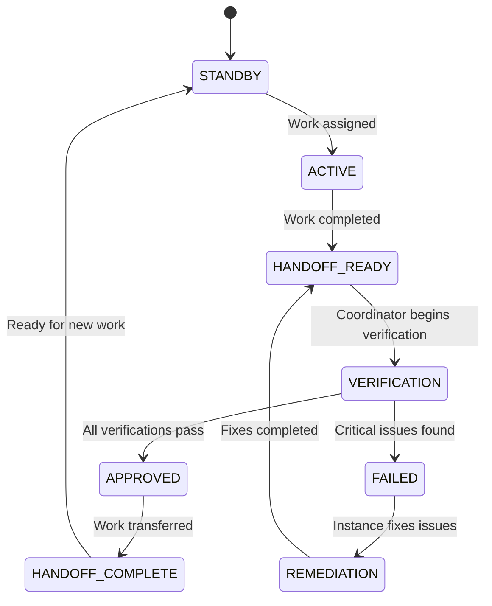

# Autonomous Multi-Instance Coordination Framework

## Overview

A comprehensive framework for coordinating multiple Claude Code instances working on the same project simultaneously, with autonomous verification and handoff management. This system eliminates manual coordination bottlenecks while maintaining quality through systematic verification.

## Core Framework Principles

### 1. Instance Specialization

**Concept**: Each instance maintains specialized context and responsibilities to maximize efficiency and minimize conflicts.

**Implementation Pattern**:
```typescript
interface InstanceSpecialization {
  role: string;
  specializations: string[];
  filesResponsible: string[];
  layerAuthority: LayerType[];
  verificationRequirements: VerificationStep[];
}
```

**Common Specialization Patterns**:
- **Backend/API Instance**: Database, services, API endpoints, business logic
- **Frontend/UI Instance**: Components, user interface, client-side logic
- **Infrastructure/DevOps Instance**: Deployment, CI/CD, infrastructure, monitoring
- **Data/Analytics Instance**: Data processing, ETL, analytics, reporting
- **Security/QA Instance**: Security audits, testing, compliance, quality assurance
- **Coordination Instance**: Integration oversight, verification, handoff management

### 2. Autonomous Coordination Authority

**Concept**: A dedicated coordinator instance that manages handoffs and integration verification without requiring human intervention for standard operations.

**Core Responsibilities**:
- Monitor instance status and work progress
- Execute automated verification suites
- Approve or deny handoffs based on predefined criteria
- Coordinate emergency responses and conflict resolution
- Escalate only critical failures or ambiguous decisions

**Implementation Framework**:
```typescript
interface CoordinationAuthority {
  monitoringInterval: number;
  autoApprovalCriteria: ApprovalCriteria;
  escalationThresholds: EscalationLevel[];
  verificationSuite: VerificationScript[];
  emergencyProtocols: EmergencyResponse[];
}
```

### 3. Layer-Based Verification

**Concept**: Systematic verification of integration points between different architectural layers to prevent invisible failures.

**Generic Layer Verification Pattern**:
```typescript
interface LayerVerification {
  layerName: string;
  inputInterface: DataContract;
  outputInterface: DataContract;
  verificationScript: string;
  dependentLayers: string[];
  performanceBenchmarks: Benchmark[];
}
```

**Common Layer Types** (adapt to your architecture):
- **Data Layer**: Database, storage, persistence
- **Service Layer**: Business logic, domain services, APIs
- **Communication Layer**: IPC, message queues, network protocols
- **Presentation Layer**: UI components, user interfaces
- **Integration Layer**: External APIs, third-party services
- **Caching Layer**: Cache systems, temporary storage

### 4. State Machine for Handoffs

**Concept**: Standardized state transitions for work handoffs with clear entry/exit criteria.



**State Definitions**:
- **STANDBY**: Instance ready to receive work assignments
- **ACTIVE**: Instance actively working on assigned tasks
- **HANDOFF_READY**: Work completed, ready for verification
- **VERIFICATION**: Coordinator running verification suite
- **APPROVED**: Verification passed, handoff approved
- **FAILED**: Verification failed, remediation required
- **REMEDIATION**: Instance addressing verification failures
- **HANDOFF_COMPLETE**: Work successfully transferred

## Implementation Templates

### 1. Status Tracking Schema

**Template Structure**:
```json
{
  "coordinationSession": {
    "sessionId": "session-{project}-{date}",
    "coordinationMode": "MULTI_INSTANCE_AUTONOMOUS",
    "totalInstances": 3,
    "currentPhase": "AUTONOMOUS_COORDINATION_READY"
  },
  "autonomousCoordination": {
    "enabled": true,
    "coordinatorInstance": "instance-coordinator",
    "autoApprovalEnabled": true,
    "escalationThreshold": "critical_failures_only",
    "monitoringInterval": 30000
  },
  "instances": {
    "instance-{role}": {
      "instanceId": "instance-{role}",
      "role": "{ROLE_NAME}",
      "status": "STANDBY|ACTIVE|COMPLETED",
      "specializations": [],
      "filesResponsible": [],
      "readyForHandoff": false,
      "nextHandoffTarget": "instance-coordinator"
    }
  },
  "handoffProtocol": {
    "currentHandoffPhase": "NONE|VERIFICATION|APPROVED|FAILED",
    "verificationRequired": []
  }
}
```

### 2. Verification Script Template

**Generic Verification Framework**:
```javascript
class GenericVerificationFramework {
  constructor(projectConfig) {
    this.projectConfig = projectConfig;
    this.violations = [];
    this.verificationResults = new Map();
  }

  async runVerificationSuite() {
    const results = {
      layerIntegrity: await this.verifyLayerIntegrity(),
      contractCompliance: await this.verifyContractCompliance(),
      dataFlowValidation: await this.verifyDataFlow(),
      performanceBenchmarks: await this.verifyPerformance()
    };

    return this.generateVerificationReport(results);
  }

  async verifyLayerIntegrity() {
    // Verify each architectural layer functions correctly
    // Check dependencies and communication between layers
  }

  async verifyContractCompliance() {
    // Verify API contracts, interfaces, and data schemas
    // Check backwards compatibility and contract adherence
  }

  async verifyDataFlow() {
    // Test end-to-end data flow through all layers
    // Verify data transformations and integrity
  }

  async verifyPerformance() {
    // Run performance benchmarks
    // Check for regressions and optimization opportunities
  }
}
```

### 3. Instance Configuration Template

**Project-Agnostic Instance Roles**:
```yaml
instances:
  backend:
    role: "BACKEND_DEVELOPMENT"
    specializations:
      - "Database operations"
      - "API development"
      - "Business logic"
      - "Service architecture"
    file_patterns:
      - "src/backend/**/*"
      - "src/services/**/*"
      - "database/**/*"

  frontend:
    role: "FRONTEND_DEVELOPMENT"
    specializations:
      - "User interface"
      - "Client-side logic"
      - "Component development"
      - "User experience"
    file_patterns:
      - "src/frontend/**/*"
      - "src/components/**/*"
      - "src/ui/**/*"

  coordinator:
    role: "INTEGRATION_COORDINATION"
    specializations:
      - "Integration verification"
      - "Handoff management"
      - "System oversight"
      - "Quality assurance"
    file_patterns:
      - "docs/**/*"
      - "scripts/verification/**/*"
      - "status/**/*"
```

## Adaptation Guidelines

### 1. Project Architecture Analysis

**Step 1**: Identify your project's architectural layers
- Map data flow through your system
- Identify integration points and dependencies
- Define clear layer boundaries and responsibilities

**Step 2**: Define instance specializations
- Group related responsibilities by expertise area
- Ensure clear ownership without overlap
- Consider team skills and project complexity

**Step 3**: Create verification requirements
- Define what "working correctly" means for each layer
- Establish performance benchmarks and quality gates
- Create automated tests for critical integration points

### 2. Technology-Specific Adaptations

**Web Applications**:
- Frontend Instance: React/Vue/Angular components, state management
- Backend Instance: API endpoints, database models, authentication
- DevOps Instance: Build pipelines, deployment, monitoring

**Mobile Applications**:
- UI Instance: Native components, user interactions, navigation
- Logic Instance: Business logic, data management, offline sync
- Platform Instance: Native integrations, app store, distribution

**Data Systems**:
- Ingestion Instance: Data collection, ETL pipelines, validation
- Processing Instance: Analytics, transformations, machine learning
- Output Instance: Dashboards, reports, API endpoints

**Microservices**:
- Service Instance: Individual service development and testing
- Gateway Instance: API gateway, routing, authentication
- Infrastructure Instance: Service mesh, monitoring, deployment

### 3. Verification Customization

**Define Layer-Specific Checks**:
```typescript
interface ProjectVerificationConfig {
  layers: {
    [layerName: string]: {
      verificationScript: string;
      dependencies: string[];
      performanceTargets: Benchmark[];
      qualityGates: QualityCheck[];
    };
  };
  integrationTests: IntegrationTest[];
  escalationCriteria: EscalationRule[];
}
```

**Example Customizations**:
- **API Projects**: Contract verification, endpoint testing, documentation sync
- **UI Projects**: Component integration, accessibility testing, cross-browser compatibility
- **Data Projects**: Pipeline validation, data quality checks, schema evolution
- **Infrastructure Projects**: Deployment validation, security scanning, monitoring setup

## Best Practices

### 1. Instance Coordination

- **Clear Boundaries**: Define non-overlapping responsibilities
- **Status Communication**: Regular status updates through shared tracking
- **Handoff Documentation**: Comprehensive handoff notes and verification requirements
- **Emergency Protocols**: Clear escalation paths for conflicts and failures

### 2. Verification Strategy

- **Automated First**: Prefer automated verification over manual checks
- **Fast Feedback**: Design verification to complete within target time (e.g., <15 minutes)
- **Comprehensive Coverage**: Verify all critical integration points
- **Performance Monitoring**: Include performance regression detection

### 3. Quality Assurance

- **Fail Fast**: Catch integration issues early in the handoff process
- **Clear Remediation**: Provide specific guidance for fixing verification failures
- **Learning Loop**: Update verification criteria based on encountered issues
- **Documentation**: Maintain clear records of decisions and rationale

## Integration with Existing Workflows

### 1. Git Integration

- Use branching strategies that support parallel instance work
- Implement merge conflict prevention through file ownership
- Create automated testing hooks for verification scripts

### 2. CI/CD Integration

- Integrate verification scripts into continuous integration
- Use instance coordination for deployment strategies
- Implement rollback mechanisms for failed handoffs

### 3. Monitoring Integration

- Set up alerts for instance failures and handoff issues
- Create dashboards for coordination health and performance
- Implement logging for audit trails and debugging

---

*This framework provides the foundation for autonomous multi-instance coordination while remaining adaptable to any project architecture or technology stack.*